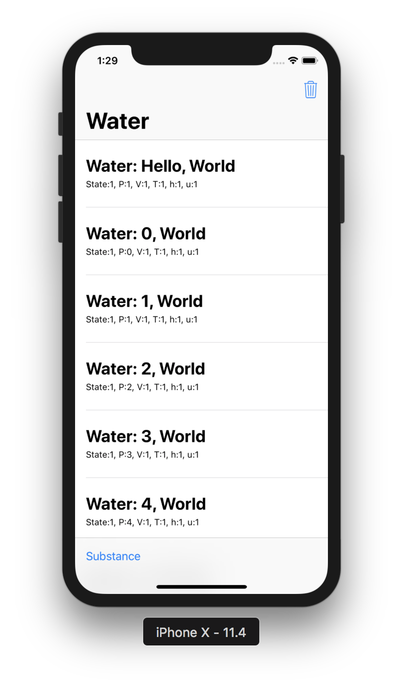
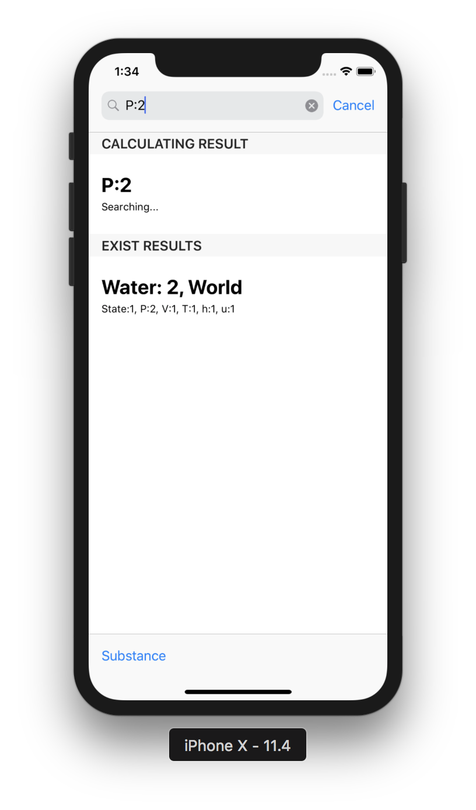
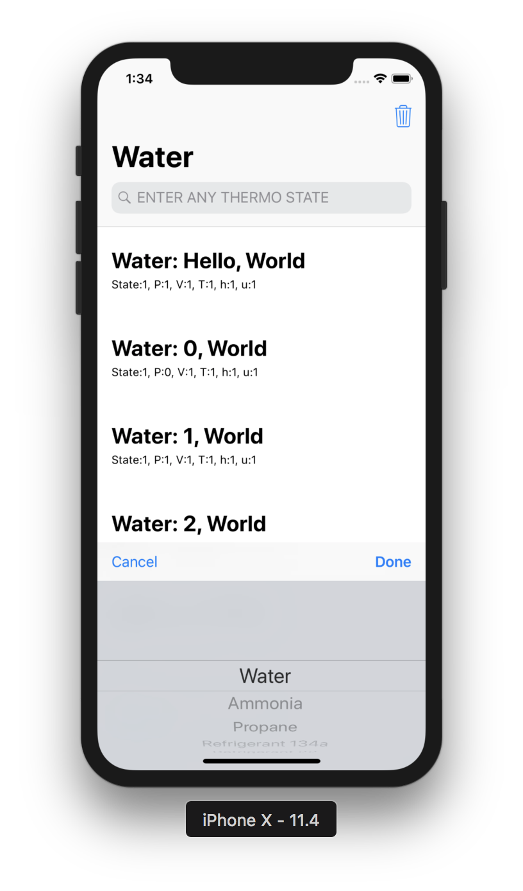
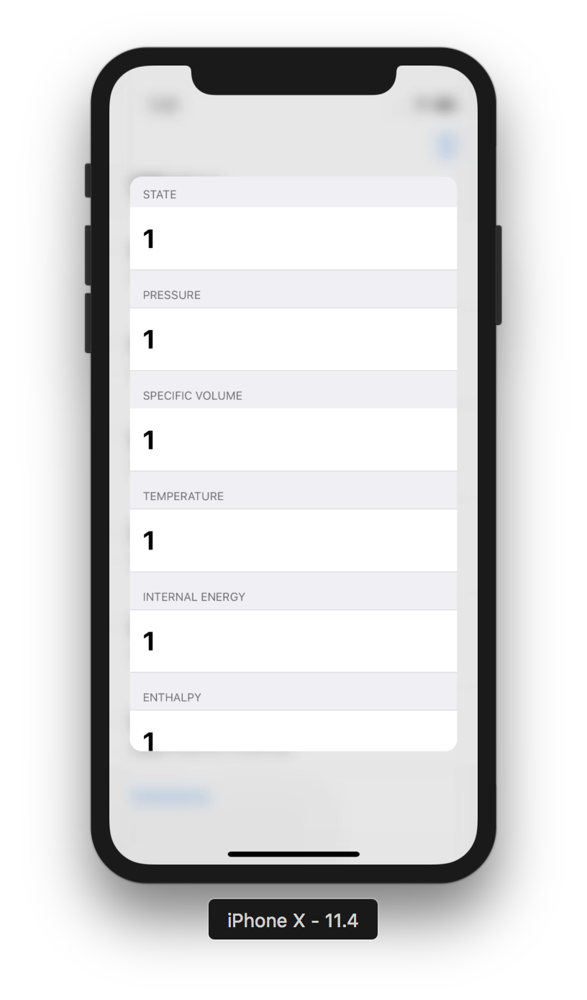
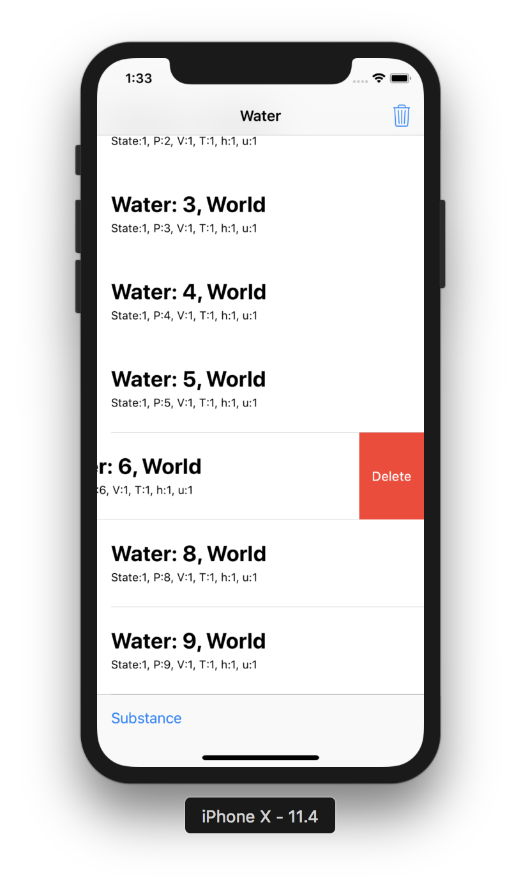

#  THERMO CALCULATOR
An iOS APP that could calculate certain state of certain substance.
It's based on the text books chart, with a linearly Linear interpolation.

As I wrote this app on macOS High Sierra, it is developed on XCode9, iOS 11, while if someone could help me update it to newest IDE?
# Usage
Just enter e.g."p=1bar, v=0.012m^3/kg" then press enter, you could get the answer.

The Main Menu is simple, like all apple stock apps.

Using the SearchBar to search. It will provide calculated results as well has search history.

Using Substance Picker allows you to change the substance to search.

And it is compatible with 3D touch Peek&Pop operations.

Using swipe to delete search records. Also you could use the delete button to clear all search results.

The App is also compatible to iPad, with providing a large view.

# Progress
- [x] UI Configuration

- [ ] Datasource setup

- [ ] Core aglorithm (In search bar)

- [ ] Distribute on App Store
