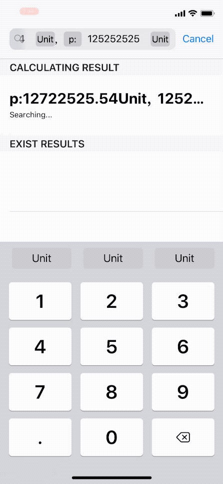
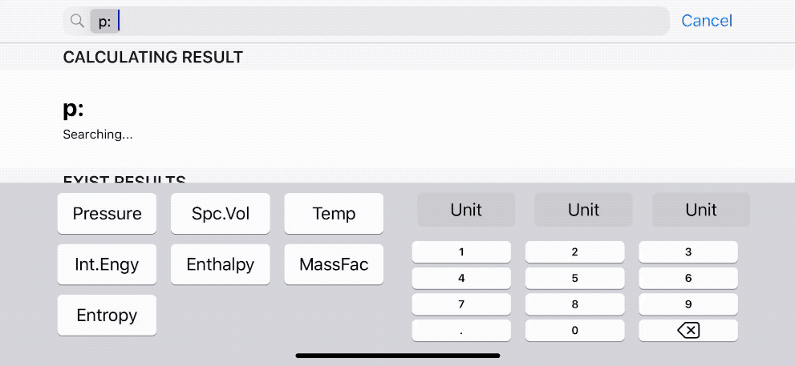

#  THERMO CALCULATOR
An iOS APP that could calculate certain state of certain substance.
It's based on the text books chart, with a linearly Linear interpolation.

As I wrote this app on macOS High Sierra, it is developed on XCode10.2, iOS 12, and is compable with iOS 11 (As I tested). The code is theorically compable with iOS 13 but I have never upgrade my system and xcode to test it. If someone could help me update it to newest swift or test the code on iOS 13 machine?
# Usage
Just enter e.g."p=1bar, v=0.012m^3/kg" then press enter, you could get the answer.

The keyboard is modified and it is smart.

The Main Menu is simple, like all apple stock apps.

Using the SearchBar to search. It will provide calculated results as well has search history.

Using Substance Picker allows you to change the substance to search.

And it is compatible with 3D touch Peek&Pop operations.

Using swipe to delete search records. Also you could use the delete button to clear all search results.

The App is also compatible to iPad, with providing a large view.

Dynamic keyboard could switch the keyboard type between State input and Decimal Input in portrait mode. 

Deleting the Header button always make people forget about input the header. This dynamic button indicator could allows you to touch it and set the header.

Horizontal view is designed for landscape orientation of iPhone and all iPads, the keyboard is more straight forward and inproves the efficiency.

# Progress
- [x] UI Configuration almost done

- [ ] Datasource setup halfdone.

- [ ] Core aglorithm (In search bar) not started yet.

- [ ] Distribute on App Store
